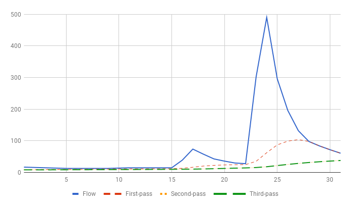

## Automated baseflow seperation using recursive filter
---
This program seperates baseflow from streamflow record using a recursive digital filter.
This is the same method thats been used in SWAT baseflow separator application.

More detail on this method can be found on the paper *Automated Methods for Estimating Baseflow and
Gground Water Recharge from Streamflow Records* (J.G.Arnold and P.M.Allen)

A sample baseflow seperation is shown below:

